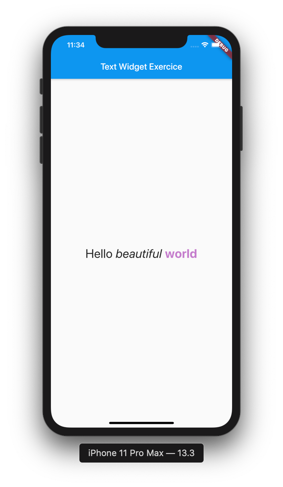

# Flutter_cheat-sheet


## Widget Catalogs

1. Text
    * Text
        - Text.Rich
        - Text.
    * Rich Text
    * Default Text Style


### Text Class
[Text Class](https://api.flutter.dev/flutter/widgets/Text-class.html) Display and style text.

```dart
Text("""
  This is a Text that is aligned on the right and
  that will display what it can on a maximum number 
  of 2 lines.
  """,
  textAlign: TextAlign.right,
  style: Theme.of(context).textTheme.title,
  textScaleFactor: 1.5,
  maxLines: 2
  ),
 ```


Using the [Text.rich](https://api.flutter.dev/flutter/widgets/Text-class.html) constructor, the Text widget can display a paragraph with differently styled TextSpans.

```dart
Text.rich(
            TextSpan(
              text: 'Hello', // default text style
              children: <TextSpan>[
                TextSpan(text: ' beautiful ', style: TextStyle(fontStyle: FontStyle.italic)),
                TextSpan(text: 'world', style: TextStyle(
                  fontWeight: FontWeight.bold, color: Colors.purple.withOpacity(0.6))
                  ),
              ],
            ),
            textScaleFactor: 2,
          )
 ```



### RichText

RichText, which gives you more control over the text styles.

```dart
const Text.rich(
  TextSpan(
    text: 'Hello', // default text style
    children: <TextSpan>[
      TextSpan(text: ' beautiful ', style: TextStyle(fontStyle: FontStyle.italic)),
      TextSpan(text: 'world', style: TextStyle(fontWeight: FontWeight.bold)),
    ],
  ),
)
  ```


### DefaultTextStyle

[DefaultTextStyle](https://api.flutter.dev/flutter/widgets/DefaultTextStyle-class.html), which sets default styles for Text widgets.

The text style to apply to descendant Text widgets without explicit style.

```dart


  ```
